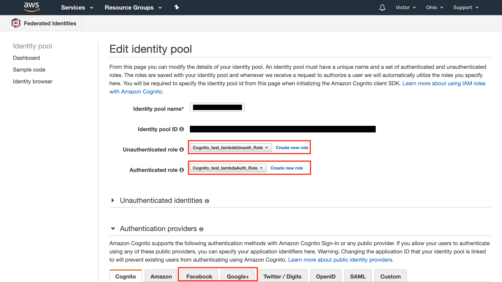
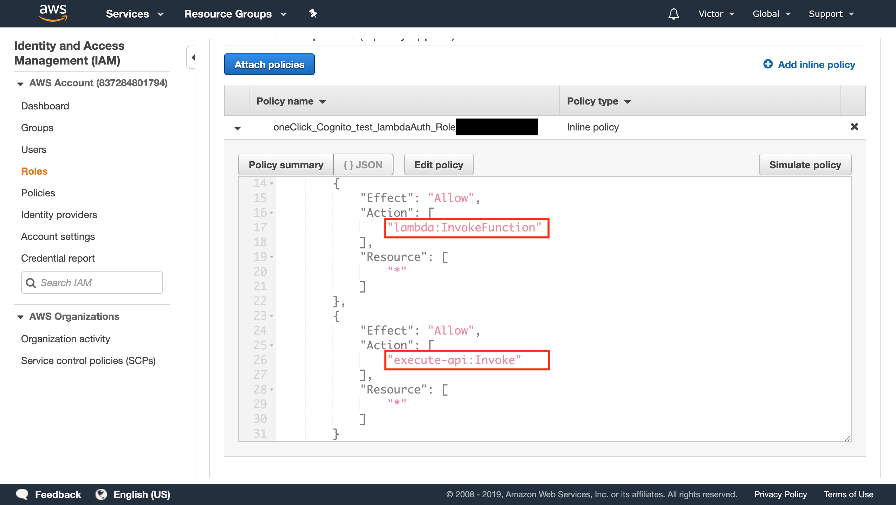
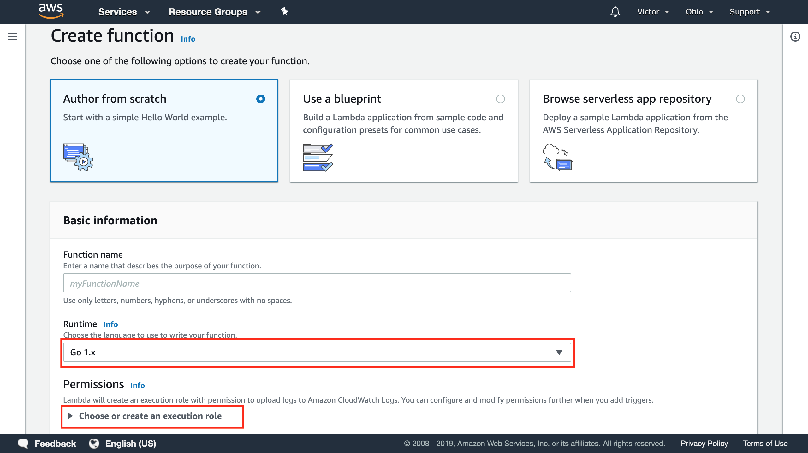
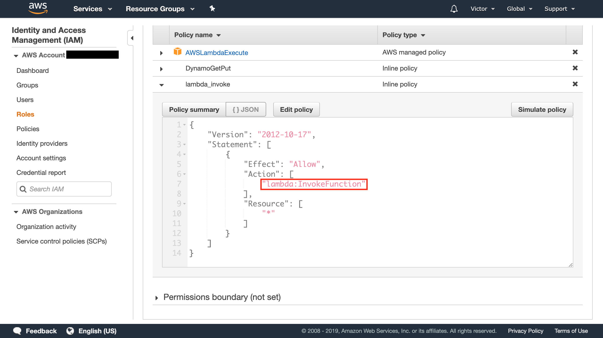
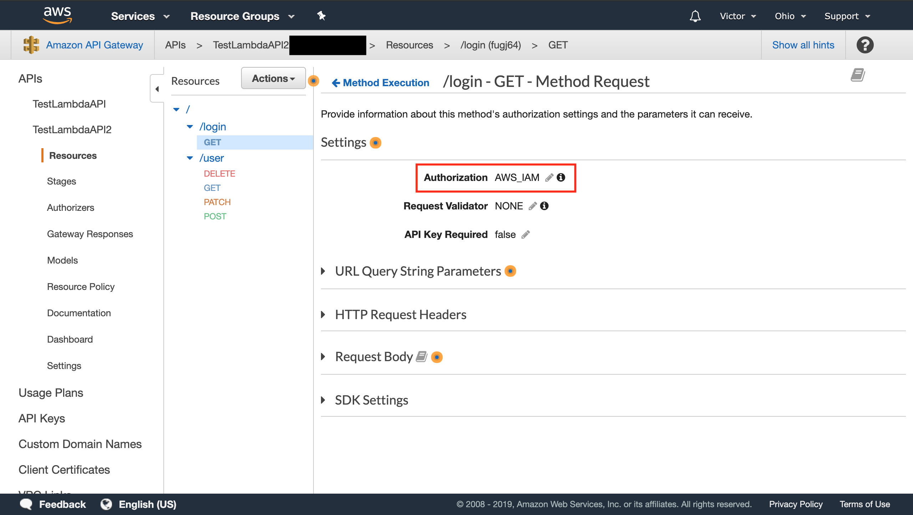
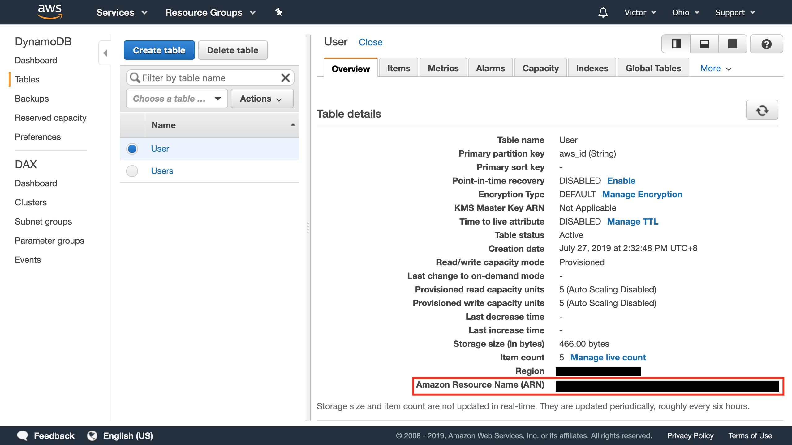
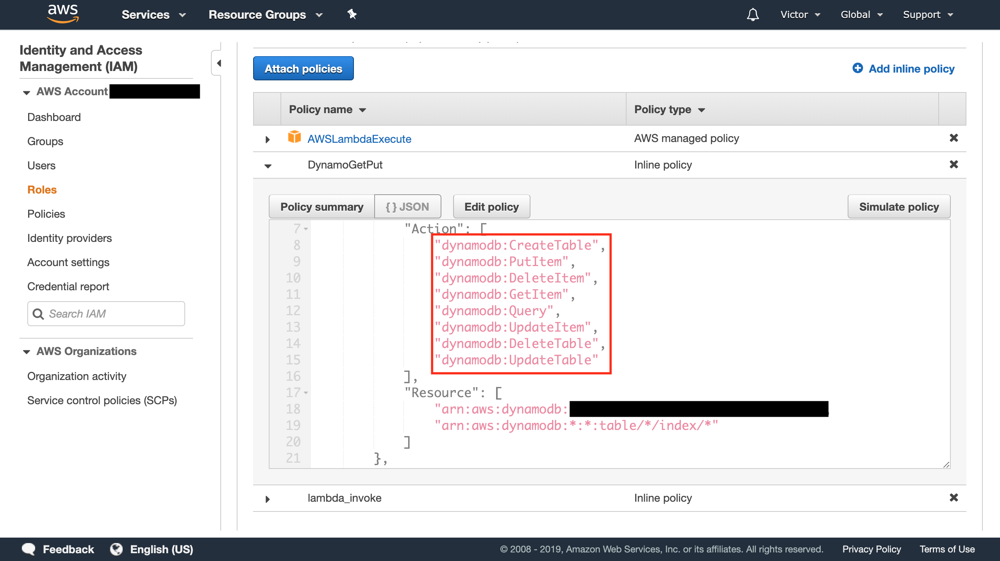

# aws_cognito_federated_exmaple

This example code will help the beginners in SaaS on AWS development.   
You could follow the source code and this article to create a simple system including the frontend iOS app and AWS backend. 

In the client-side, the iOS app import AWS SDK to handle API from the server, and integrate third-party login service.  
In the server-side, we use Amazon Cognito Federated Identities to manage the login account(including Facebook and Google), Lambda and API Gateway provide RESTful API to the client-side, and access the user data in DynamoDB.  

## Contents
- [Learn](#learn)
- [Requirements](#requirements)
- [Usage](#usage)
- [Author](#author)
- [License](#license)

## Learn

iOS APP:
- [Facebook Login SDK](#facebook_login)
- [Google Login SDK](#google_login)
- [AWS iOS SDK](#aws_ios_sdk)

Golang backend:  
You need to deploy these service on AWS to finish the example. 
- [Amazon Cognito Federated Identities](#cognito_federated)
- [IAM](#iam)
- [Lambda(Golang)](#lambda)
- [API Gateway](#api_gateway)
- [DynamoDB](#dynamodb)

## Requirements

Client:
- iOS 10.0+
- Xcode 8.0+
- Swift 3.0+

Server:
- AWS Lambda
- Golang 1.0+
- Framework Gin

## Usage

### Facebook_Login
Reference: [Facebook Developer Website](https://developers.facebook.com/docs/swift/getting-started)

#### MainViewController.swift
After login the FB account, we need to call syncLogin to trigger AWSIdentityProviderManager logins() callback.
```swift
fbLoginManager.logIn(readPermissions: [.publicProfile, .email], viewController: self) { loginResult in
            DispatchQueue.main.async {
                switch loginResult {
                case .cancelled:
                    print("User cancelled login")
                case .failed(let error):
                    print(error)
                case .success( _, _, _):
                    print("Facebook logged in")
                    isLogin = true
                    loginTypeName = LoginType.facebook.name
                    
                    self.syncLogin()
                }
            }
}
```
### Google_Login
Reference: [Google Developer Website](https://developers.google.com/identity/sign-in/ios)

#### MainViewController.swift
After login the Google account, we need to call syncLogin as above.
```swift
GIDSignIn.sharedInstance().clientID = GOOGLE_CLIENT_ID
GIDSignIn.sharedInstance().delegate = self
GIDSignIn.sharedInstance()?.uiDelegate = self
GIDSignIn.sharedInstance().signIn()
```
```swift
extension MainViewController: GIDSignInDelegate, GIDSignInUIDelegate {
    func sign(_ signIn: GIDSignIn!, didSignInFor user: GIDGoogleUser!, withError error: Error!) {
        if error != nil {
            print("Google login error: \(error.localizedDescription)")
        }else {
            print("Google login success")
            isLogin = true
            loginTypeName = LoginType.google.name
            APISession.shared.googleIdToken = user.authentication.idToken
            
            syncLogin()
            GIDSignIn.sharedInstance()?.signOut()
        }
    } 
}
```

### AWS_iOS_SDK

#### APISession.swift
Setup your AWS credentials provider at first, you must create a CognitoIdentityPoolId on AWS to manage your account system. 
```swift
func setConfiguration() {
        credentialsProvider = AWSCognitoCredentialsProvider(
            regionType: CognitoIdentityUserPoolRegion,
            identityPoolId: CognitoIdentityPoolId,
            identityProviderManager: ThirdPartyLoginProvider())
        let configuration = AWSServiceConfiguration(
            region: CognitoIdentityUserPoolRegion,
            credentialsProvider: credentialsProvider)
        
        AWSServiceManager.default().defaultServiceConfiguration = configuration
}
```

The most important part!  
This delegate will automatically trigger logins() function when token not found or expired on AWS IAM.  
Therefore, in our system the authorization in API is IAM, we don't need to bring token in the header field.  

```swift
class ThirdPartyLoginProvider: NSObject, AWSIdentityProviderManager {
    func logins() -> AWSTask<NSDictionary> {
        switch loginType! {
        case .facebook:
            if let token = AccessToken.current?.authenticationToken {
                return AWSTask(result: [AWSIdentityProviderFacebook: token])
            }else {
                return AWSTask(error:NSError(domain: "Facebook Login", code: -1 , userInfo: ["Facebook" : "No current Facebook access token"]))
            }
        case .google:
            if let token = APISession.shared.googleIdToken {
                return AWSTask(result: [AWSIdentityProviderGoogle: token])
            }else {
                return AWSTask(error:NSError(domain: "Google Login", code: -1 , userInfo: ["Google" : "No current Google access token"]))
            }
        }
    }
}
```

After function trigger return AWSTask, you can get the current logged in aws id.
```swift
let aws_id = APISession.shared.credentialsProvider.identityId ?? ""
```
### Cognito_Federated
After you create a new identity pool, you can edit the identity pool like the following image.  


Select the drop-down menu to choose or create an unauthenticated/authenticated role in IAM.    
You must add two actions to allow this IAM can support to invoke Lambda and execute API Gateway.  
The IAM example for Cognito Auth show as below.   



### IAM
You would see the IAM tutorials in Cognito Federated, Lambda and Dynamodb sections.


### Lambda
Create your testing function in Lambda, and set up the configuration as below.  


In the permissions column, you would create the IAM for the Lambda function.  
AWSLambdaExecute is the default policy for lambda IAM.   
Then we can create the other inline policy for invoking Lambda.  


After creating the Lambda function, we could upload your backend codes.  
Run the [build.sh](golang_server/test_lambda/build.sh) file to produce the go binary file.  


Some tutorials codes show as below.  
#### router.go
In order to support AWS Lambda in Gin, we use this [reference](https://github.com/apex/gateway) to overwrite default Gin Run.
```go
func RunServer() {
	// AWS server
	addr := ":" + os.Getenv("PORT")
	log.Fatal(gateway.ListenAndServe(addr, routerEngine()))
}
```

#### user.go
In our example, after iOS app login a newcomer on server and trigger POST method, we will create a new identity in User DynamoDB.  
You can see more detail about DynamoDB in our code.
```go
func CreateUser(c *gin.Context) {
	var u db.U
	......
	user := &db.User{
		ID: uuid.New(),
		U: u,
	}
	err := db.CreateUser(user)
	......
}
```

### API_Gateway
In this part, we show you an important thing to help you set up the authorization.
First, we create different methods in resources, and after that choosing the method execution to set your API authorization is AWS_IAM.


Finally, when we invoke the API from the client-side, AWS IAM will help you to check the authorization is correct or not.  


### Dynamodb
Using the Dynamodb for your backend database, you can create the DB table on AWS dashboard.  
And then, choosing the overview section to see the table details, and copy your table ARN.  


Select your created Lambda IAM, and add a new inline policy to IAM.  
There are lots of Dynamodb actions you could choose on AWS, selecting the actions you need to control the DB.  



## Author

minyingwu, minyingwu123@gmail.com

## License

aws_cognito_federated_exmaple is available under the MIT license. See the LICENSE file for more info.


